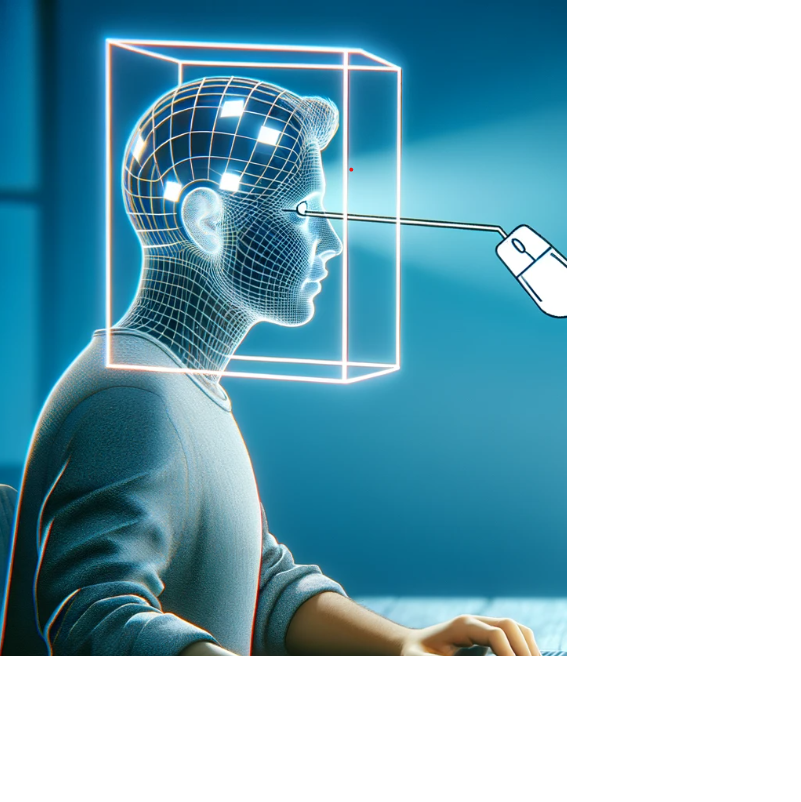

# Sistema de Controle de Cursor via Rastreamento Facial

Este projeto implementa um sistema de controle do cursor do mouse usando rastreamento facial em tempo real. Utiliza a biblioteca OpenCV para detecção de rosto e a biblioteca PyAutoGUI para controlar o cursor do mouse.

## Funcionalidades

- Detecção de rosto em tempo real usando uma webcam.
- Mapeamento do movimento da cabeça para movimentar o cursor do mouse na tela do computador.
- Capacidade de controlar o cursor do mouse em tempo real com movimentos da cabeça.
- Usar comando do mouse por comando de voz

## Pré-requisitos

Antes de iniciar, assegure-se de que você tenha instalado:

- Python 3
- OpenCV (`opencv-python`)
- PyAutoGUI

## Instalação

Para configurar este projeto, siga estes passos:

1. Clone o repositório para sua máquina local.
2. Instale as dependências necessárias utilizando o seguinte comando:

pip install -r requiriments.txt

3. Execute o script principal para iniciar o rastreamento facial.

## Uso

Para usar o sistema de rastreamento facial, siga estas instruções:

1. Execute o script `face_tracking.py`.
2. Posicione-se de forma que sua webcam possa capturar claramente seu rosto.
3. Movimente sua cabeça para controlar o cursor do mouse na tela.

## Limitações e Melhorias

- A precisão do rastreamento facial pode variar dependendo das condições de iluminação e da qualidade da webcam.
- Melhorias na estabilidade e precisão do rastreamento são possíveis e desejáveis.

## Contribuições

Contribuições para o projeto são bem-vindas. Sinta-se à vontade para clonar, modificar e enviar pull requests.
